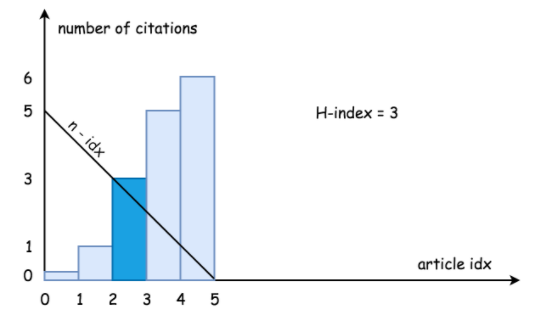

## 二分法 ##
- 特殊的双指针。
- 考虑**中点选取**、**左右边界相等**两点。

### 求目标解 ###
```
    int find(int[] nums, int target) {
        int l = 0;
        int r = nums.length - 1;
        while (l <= r) {
            int m = l + (r - l) / 2;
            //满足条件
            if (nums[m] == target) {
                return m;
            } else if (nums[m] > target) {
                r = m - 1;
            } else {
                l = m + 1;
            }
        }
        return -1;
    }
```
- [矩阵查找](../src/binarySearch/Searcha2DMatrixII.java)
  - 左下角中间点，row--向前搜索，col++向后搜索
  
### 求最值 ###
- [寻找峰值](../src/binarySearch/FindPeakElement.java)
- [不重复旋转数组最值](../src/binarySearch/FindMinimuminRotatedSortedArray.java)
  - nums[mid]<nums[mid-1]：mid为最低点
  - nums[mid]>nums[r]：mid在左半边，[mid+1,r]搜索，否则右半边，[l,mid]搜索
- [重复旋转数组最值](../src/binarySearch/FindMinimuminRotatedSortedArrayII.java)
  - 比不重复多考虑num[mid]==num[r]的场景，
    - 有两种情况：mid和r在两侧；2.mid,r都在右侧。只能r--缩小范围
> 类似求左边界

### 求左边界 ###
```
    private int findFirst(int[] nums, int target) {
        int l = 0;
        int r = nums.length - 1;
        while (l < r) {
            //中点偏左
            int m = l + (r - l) / 2;
            if (nums[m] < target) {
                //左端点+1
                l = m + 1;
            } else {
                r = m;
            }
        }
        return nums[l] == target ? l : -1;
    }
```
- [在排序数组中查找元素的第一个和最后一个位置](../src/binarySearch/FindFirstandLastPositionofElementinSortedArray.java)
- [在 D 天内送达包裹的能力](../src/binarySearch/CapacityToShipPackagesWithinDDays.java)
- [求H因子2](../src/binarySearch/HIndexII.java) 
  - 寻找引用数citations[i]>=n-i的i左边界：[i,n)共n-i篇文章引用数都>=n-i
  - 

### 求右边界 ###
```
    private int findLast(int[] nums, int target) {
        int l = 0;
        int r = nums.length - 1;
        while (l < r) {
            //中点偏右
            int m = l + (r - l + 1) / 2;
            if (nums[m] > target) {
                //右端点-1
                r = m - 1;
            } else {
                l = m;
            }
        }
        return nums[r] == target ? r : -1;
    }
```
- [在排序数组中查找元素的第一个和最后一个位置](../src/binarySearch/FindFirstandLastPositionofElementinSortedArray.java)
