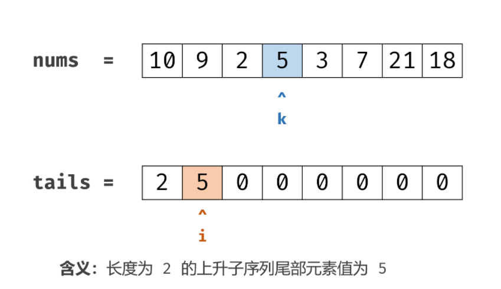
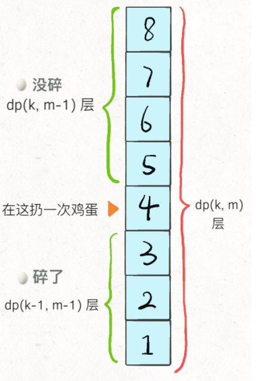

## 动态规划 ##
- 状态。状态可以穷举为多维dp数组。
- 选择。
- 状态转移。

### 一维动规　###
- [爬楼梯](../src/dp/ClimbingStairs.java)
- [统计打字方案数](../src/dp/CountNumberofTexts.java)


### 二维动规 ###
- [字符串编辑距离](../src/dp/EditDistance.java)
  - 状态：dp[i][j]，s1[0,i)->s2[0,j)的编辑距离。
  - 状态转移：不变、增、删、改
    - 增：s1[0,i)->s2[0,j-1)，s2末增加s2[j-1]。
    - 删：s1[0,i-1)->s2[0,j)，s1末尾删除s1[i-1]。
    - 改：s1[0,i-1)->s2[0,j-1)，s1末尾改成s2[j-1]。
- [最长公共子序列](../src/dp/LongestCommonSubsequence.java)
- [乘积最大子数组](../src/dp/MaximumProductSubarray.java)
  - 最大子数组为正数×前一位结尾的最大正数子数组 或者 负数×前一位结尾的最小负数子数组
- [戳气球](../src/dp/BurstBalloons.java)
  - dp[i][j]：戳破(i,j)之间所有气球可获得的最大值，目标dp[0][m-1]
  - 最后一个戳破的气球可能是(i,j)中的任意一个，需要遍历取最大值
  -  dp[i][j] = Math.max(dp[i][j], dp[i][last] + dp[last][j] + money[last] * money[i] * money[j]);
- [ 组合总和 Ⅳ](../src/dp/CombinationSumIV.java)
  - dp[i]: 目标和是i的组合数量
 ```
for (int i = 1; i <= target; i++) {
  for (int last : nums) {
     //最后一个数字是last
     dp[i] += dp[i - last];
  }
 }
 ```

### 三维动规 ###
- 博弈问题:[石子游戏](../src/dp/StoneGame.java)
  - 状态：dp[i][j][0]-先手最大值，dp[i][j][1]-后手最大值。
  - 状态转移：中心开始遍历。
    - 作为先手（主动）：遍历先手操作，根据先手结果+剩下后手最优解，决定先手操作。
    - 作为后手（被动）：根据先手操作，剩下的作为先手。
- [股票系列问题](../src/dp/BestTimetoBuyandSellStockIV.java)
  - 状态：dp[i][j][0]-第i天交易j次空仓最大利润，dp[i][j][1]-第i天交易j次满仓最大利润。
  - 状态转移：
    - 空仓：昨天空仓；昨天满仓，今天卖出。
    - 满仓：昨天满仓；昨天空仓，今天买入。

### 动规+二分法 ###
> dp数组单调递增可使用。
- [最长递增子序列](../src/dp/LongestIncreasingSubsequence.java)
  - 状态：dp[i]，长度为i的LIS，末尾元素最小值。<br>
  - 状态转移：二分查找num[i-1]在dp[1,len]中的左边界
    - 无左边界,dp[1,len]<num[i-1]，最长递增子序列长度+1
    - 有左边界，nums[i-1]替换该左边界值，最长递增子序列长度不变<br>
- [使数组 K 递增的最少操作次数](../src/weekly/kIncreasing.java)
  - 分为k组求最长非递减子序列长度
  - 每组长度和子序列长度差为最小操作次数

### 动规+后续遍历 ###
- [打家劫舍系列问题](../src/dp/HouseRobberIII.java)。
  - 状态：dp[0]：不抢node的最大值；dp[1]：抢node的最大值
  - 状态转移：
    - 不抢node，子节点可抢可不抢
    - 抢node，子节点不可抢
    
### 求下标 ###
- [鸡蛋掉落](../src/dp/SuperEggDrop.java)
  - 状态：dp[k][m],k个鸡蛋摔m次可以测试的层数
  - 状态转移<br>
