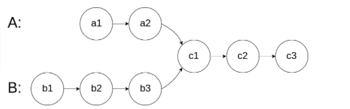
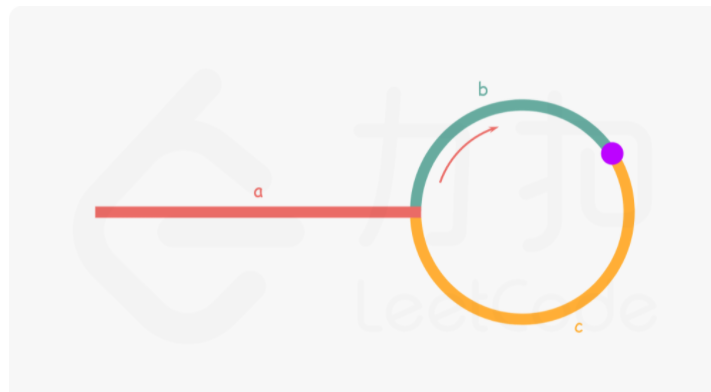

## 双指针 ##
### 同向指针 ###
- [判断链表交点](../src/twoPointer/IntersectionofTwoLinkedLists.java)：相同速度遍历链表A之后遍历链表B，直到指向同一个节点
  - 节点非Null:相交，节点Null：不相交
  - 
- [还原原数组](../src/weekly/RecovertheOriginalArray.java)
  - lower[0]必定是lower[0],higher[0]必定在nums[1~n]
  - 枚举lower[0],higher[0]，双指针还原lower,higher


### 快慢指针 ###
> 主要解决链表问题。
- 链表的环
  - [判断环形链表](../src/twoPointer/LinkedListCycle.java)
  - [找环形链表入口](../src/twoPointer/LinkedListCycleII.java)
    - 快慢指针相遇后快指针从链表头开始，两个指针同速遍历，再次相遇为入口，<br>
    - 原理：相遇时2*(a+b)=a+2b+c -> a=c
- 链表中点
- 链表kth元素

### 左右指针 ###
- [二分查找](./二分法.md)
- [多个数之和](../src/twoPointer/FourSum.java)
- [接雨水2D](../src/twoPointer/TrappingRainWater.java)

#### 滑动窗口 ####
- [无重复字符的最长子串](../src/twoPointer/LongestSubstringWithoutRepeatingCharacters.java)
```
int left = 0, right = 0;
//[left,right)为窗口
while (即将添加的下标为right的右端点合法) {
	右端点加入窗口
	while (窗口需要缩小) {
		//求最长窗口时窗口不满足条件则缩小
		//求最短窗口时窗口满足条件则缩小
		左端点移出窗口
	}
}
```

### 两个对象分别持有指针 ###
- 归并数组
- [通过删除字母匹配到字典里最长单词](../src/twoPointer/LongestWordInDictionaryThroughDeleting.java)