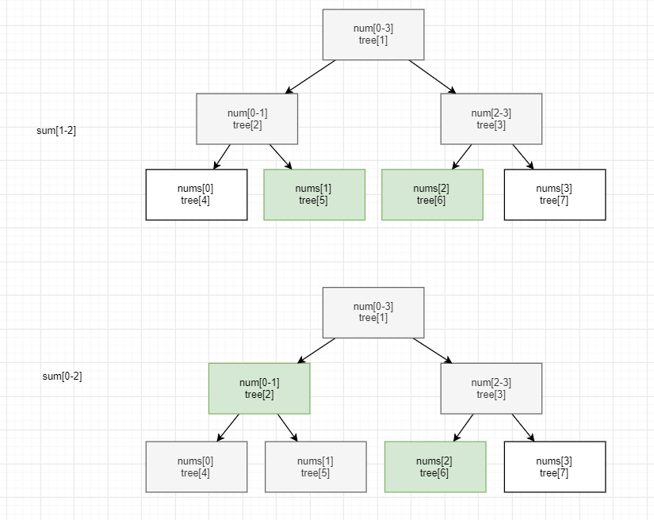

## 树 ##
### DFS和BFS ###
- [搜索](./搜索.md)

### 二叉树 ###
#### 遍历 ####
- 递归实现。都懂...
- 非递归实现。
  - [前序遍历](../src/stack/BinaryTreePreorderTraversal.java)
  - [中序遍历](../src/stack/BinaryTreeInorderTraversal.java)
  - [后序遍历](../src/stack/BinaryTreePostorderTraversal.java)
- [公共先祖](../src/binarySearch/LowestCommonAncestorofaBinaryTree.java)。后序遍历 

#### 翻转 ####
> 分治+后序遍历
- [翻转二叉树](../src/dfs/InvertBinaryTree.java)，步骤：
  1. 翻转左子节点为根的二叉树
  2. 翻转右子节点为根的二叉树
  3. 左右子节点交换位置

#### 二叉查找树 ####
> 中序遍历==有序数组
- 中序遍历 == 从小到大遍历。
  - [有序链表构造平衡的二叉查找树](../src/dfs/ConvertSortedListtoBinarySearchTree.java)
    - 分治：链表的[left,mid),(mid,right]分别构建为树，分别为左右子节点
- TreeSet维护有序数组,O(logn)复杂度
  - [排座位](../src/binarySearch/ExamRoom.java)
  
#### 线段树 ####
> 
- [可变范围和](../src/binaryIndexedTree/RangeSumQueryMutable2.java)
  - 数组表示树(类似数组实现堆)
    - tree[n,2n) 存nums[0,n)，根节点为tree[1],tree[0]空置
    - tree[i]的值和下标范围为两个子节点和，左子节点为tree[2i],右子节点为tree[2i+1]
    - 更新时从叶节点向根节点更新
    - 范围查询时从两个叶节点开始向中间靠拢
      - 边界为内侧节点累加、向内移动1后上升
      - 边界为外侧节点直接上升
- 

### Trie树 ###
- [实现前缀树](../src/trieTree/ImplementTrie.java
```
    class TrieNode {
        private char val;
        private boolean isEnd;
        private TrieNode[] children;
    }
```
